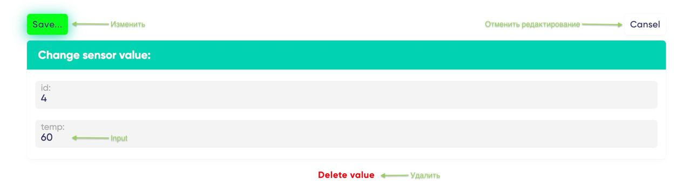

# temperature sensor

P.S. This repository contains the temp-sensor project developed by Igor Kobozev.

###### Tech: Vue 3 + TypeScript + Vite + Pinia + Persist + Router

## initialization
 node -v >16.14.0
```
npm i
```
```
npm run dev
```
## Функционал:
> 1. Добавлена cтраница со списком/таблицей всех показаний (/)
>
>
>
>> * есть кнопка перейти к созданию новой записи
>> * и сам список записей
>> * первыми идут записи добавленные последними
>> * для каждой записи отображается ID и температура
>> * для каждой записи есть возможность перейти к изменению
>> * для каждой записи есть возможность удаления (необходимо подтверждение)

>2. Cтраница изменения/добавления показаний (/edit)
>###### Редактировать:
>
>
>###### Добавить:
>
>
>> * поле для ввода/изменения значения
>> * возможность сохранить изменения
>> * отменить редактирование (необходимо подтверждение)
>> * удалить показание (необходимо подтверждение)
>> * добавить новое показание

>###### Дополнительные возмодности:
>  * Подтверждение действий (удалить/отменить) выполняется с помощью диалогового окна.
> 
>  * Без использования "alert", "prompt" и "confirm".
>  * После перезагрузки страницы состояние списка заметок сохратяется (pinia-plugin-persistedstate).
>  * В приложении используется синтаксис Vue3, State manager: Pinia и Vue-router.
>  * Язык разработки TypeScript.
>  * Верстка выполнена без использования UI библиотек.
>  * Адаптивность есть.
>  * Логика приложения разбита на разумное количество самодостаточных Vue-компонентов.
>  * Все действия на сайте происходят без перезагрузки страницы.
>  * В проекте используется pretter, все основные фунции и интерфейсы снабжены коментариями.

## Архитектура:
В приложении есть два основных гобальных сотсояния(store), которые упраляют приложеним:
###### Measures (id: number, temp: number) - объект состояния датчика
```
state: () => ({
    ids: [], // все id
    all: new Map([]), // Map объект со списком в всех объектов состояния датчика с ключем id
    selectedMeasure: null, // выбранный датчик для редактирования
  })
```
> Этот state сохраняется в localStorage
###### Warning (text: string, callback: ()=>void) - объект состояния для компонента подтверждения.
```
state: () => ({
    isVisible: false, // состояние показа подтверждения
    warningObj: { // объект для компонента Warning
      text: '', // текст для Warning ('прервать редактироваине/удалить объект').
      callback: () => {}, // функция которая вызывается после подтверждения.
    },
  })
```


 ###### В остальном, компоненты манипулируют и управляют состоянием этих объектов.
